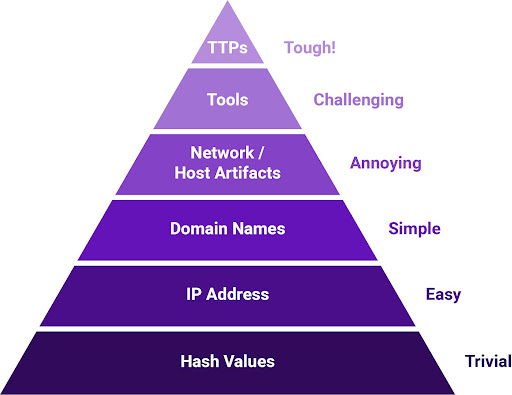

# Purple Team Exercise Framework

Created and provided to the community by the team at SCYTHE.
Please consider contributing by submitting pull requests. 

# Executive Summary

This document defines a **Purple Team Exercise Framework (PTEF) **to facilitate the creation of a formal **Purple Team Program**. Purple Team Exercises are an efficient method to test, measure, and improve your organization’s resilience to an attack. A Purple Team focuses on fostering collaboration with your entire security stack including people, process, and technology.

## What is a Purple Team?

A Purple Team is a collaboration of various information security skill sets:

* Cyber Threat Intelligence - research and provide adversary tactics, techniques, and procedures (TTPs)
* Red Team - offensive team in charge of emulating adversaries and TTPs
* Blue Team - the defenders. May include but is not limited to Security Operations Center (SOC), Hunt Team, Digital Forensics and Incident Response (DFIR), and/or Managed Security Service Providers (MSSP).

## Types of Purple Teaming

As a Purple Team is a collaborative effort between various information security skill sets, it may be applied in a variety of ways. Organizations new to Purple Teaming will start with an ad-hoc Purple Team Exercise to foster the collaboration between the various teams in a single exercise. As the value of Purple Teaming becomes apparent, more exercises are planned and scheduled. 

Eventually, organizations operationalize the Purple Team function to collaborate as new intelligence or TTPs are discovered. Some organizations build dedicated Purple Team while others keep them separate and use Purple Teaming as a functional, virtual team. Regardless of the model used, the Purple Team can be measured and improved following the Purple Team Maturity Model (PTMM). 

### Purple Team Exercise

A **Purple Team Exercise** is a full knowledge information security assessment where attendees collaborate to attack, detect, and respond. Attack activity is exposed, explained, and shown to the attendees as it occurs while defenders also show how they detect and respond. Purple Team Exercises are "hands-on keyboard" exercises where attendees work together with an open discussion about each attack technique and defense expectation to test, measure, and improve people, process, and technology in real-time. Purple Team Exercises are Cyber Threat Intelligence led, emulations of Tactics, Techniques, and Procedures (TTPs) to identify and remediate gaps in the organization’s security posture.  

At a high level, a Purple Team Exercise is executed with the following flow:

### Operationalized Purple Team 

Purple Teaming can be operationalized with dedicated stakeholders from a variety of information security roles (CTI, Red, and Blue teams) working together as a virtual team. When new TTPs are discovered, they are analyzed, discussed, and emulated to continually build and improve detection and response. This document covers both how to run Purple Team Exercises and how to operationalize purple teaming.

## Purple Team Maturity Model

Regardless of implementation, a purple team program can be measured and matured following the Purple Team Maturity Model (PTMM). The maturity model looks at purple team activities as a unified effort with two key areas of expertise: Threat Understanding and Detection Understanding. Within each area of expertise there are three levels for teams to measure their maturity by: Deployment, Integration, and Creation. Utilizing this model, purple team programs can chart a strategic map around how to build internal capability for purple team activities. 

# Goals & Objectives

Purple Team Exercises are triggered by the need to test, measure, and improve people, process and technology. Information security professionals from various teams (Blue Team, CTI, and Red Team) will learn and practice their dedicated functions while improving process, and technology. The end goal is increasing resilience to current threats by detecting and responding to attacks before impact. Purple Team Exercises will have specific goals which drive the planning process depending on the maturity level of the organization and current objectives. Purple Team Exercises may have one or more of these goals:

* Foster a collaborative culture within the security organization
* Test attack chains against a target organization
* Train the organization’s defenders (Blue Team)
* Test TTPs that have not been tested before in the organization
* Test the processes between security teams
* Preparation for a zero-knowledge Red Team Engagement
* Red Team reveal or replay after a zero-knowledge Red Team Engagement

# 

# Methodology

Leveraging frameworks and methodologies for information security assessments is a best practice to show your sponsors, stakeholders, customers and/or clients you have a repeatable, professional process. No one wants to hire or agree to an engagement without a plan in place that will bring value to the business.  The Purple Team Exercise Framework is in-itself a methodology covering Cyber Threat Intelligence, Preparation, Exercise Execution, and Lessons Learned:

## Other Methodologies and Frameworks

There are other frameworks for information security assessments such as Threat-Led Penetration Testing and Red Teaming. A mirror of each of the below frameworks is available on the SCYTHE library: [https://www.scythe.io/library/red-team-and-threat-led-penetration-testing-frameworks](https://www.scythe.io/library/red-team-and-threat-led-penetration-testing-frameworks) 

### Industry Frameworks and Methodologies

Industry frameworks are created by those in the industry to be leveraged by other organizations without forcing any sort of regulatory compliance mandates.

* Cyber Kill Chain – Lockheed Martin - educated many non-technical consumers on how adversaries function and the steps they perform during a breach.
* Unified Cyber Kill Chain – Paul Pols - university paper bringing together a number of Cyber Kill Chains by various industry contributors.
* MITRE ATT&CK - the current industry standard and language for Adversary Tactics, Techniques, and Common Knowledge.‍

### Regulatory Frameworks and Methodologies

Organizations operating in highly regulated industries, such as financial institutions, and/or in various jurisdictions, have the following frameworks and methodologies to follow:

* G-7 Fundamental Elements for Threat-Led Penetration Testing - the Group of 7 nations provided guidance on performing Threat-Led Penetration Testing
* CBEST Intelligence Led Testing – Bank of England - Regulation for financial institutions operating in England
* Threat Intelligence-Based Ethical Red Teaming – TIBER-EU - framework that can be leveraged by any country in the European Union and offers cross-jurisdiction and mutual recognition of Red Team engagements
* Red Team: Adversarial Attack Simulation Exercises – Association of Banks of Singapore (ABS) 
* Intelligence-led Cyber Attack Simulation Testing (iCAST) – Hong Kong Monetary Authority (HKMA)
* Financial Entities Ethical Red-Teaming – Saudi Arabian Monetary Authority (SAMA)
* Cyber Operational Resilience Intelligence-led Exercises (CORIE) - Australia
* A Framework for the Regulatory Use of Penetration Testing and Red Teaming in the Financial Services Industry – Global Financial Markets Association (GFMA)

# 

# Roles and Responsibilities

Successful Purple Team Exercises require the active planning and participation of a wide range of stakeholders throughout the phases of the Purple Team Exercise: (1) Cyber Threat Intelligence, (2) Preparation, (3) Exercise Execution and (4) Lessons Learned. The below table has an example of Roles and Responsibilities for a Purple Team Exercise. 

Please note that not all organizations or exercises require all these stakeholders. Purple Team Exercises can leverage internal and/or external teams. For example, an organization may not have an internal Cyber Threat Intelligence team or they may outsource the SOC to a managed security provider. These organizations can still leverage the efficiencies and benefits of a Purple Team Program.

<table>
  <tr>
   <td><strong>Title</strong>
   </td>
   <td><strong>Role</strong>
   </td>
   <td><strong>Responsibility</strong>
   </td>
  </tr>
  <tr>
   <td>Project Manager
   </td>
   <td>Exercise Coordinator
   </td>
   <td>Lead point of contact throughout the entire Purple Team Exercise. Responsible for ensuring Cyber Threat Intelligence is provided. Ensures all Preparation steps are taken prior to Exercise Execution. During 

Exercise Execution, record minutes, notes, action items, and feedback. Send daily emails with those notes as well as guidance for what’s planned for the next day. Compile and deliver Lessons Learned.
   </td>
  </tr>
  <tr>
   <td>Head of Security
   </td>
   <td>Sponsor
   </td>
   <td>Approve Purple Team Exercise and Budget
   </td>
  </tr>
  <tr>
   <td>Cyber Threat Intelligence
   </td>
   <td>Sponsor
   </td>
   <td>Cyber Threat Intelligence
   </td>
  </tr>
  <tr>
   <td>Red Team Manager
   </td>
   <td>Sponsor
   </td>
   <td>Preparation: Define Goals, Select Attendees
   </td>
  </tr>
  <tr>
   <td>Blue Team Manager
   </td>
   <td>Sponsor
   </td>
   <td>Preparation: Define Goals, Select Attendees
   </td>
  </tr>
  <tr>
   <td>DFIR Manager
   </td>
   <td>Sponsor
   </td>
   <td>Preparation: Define Goals, Select Attendees
   </td>
  </tr>
  <tr>
   <td>Red Team
   </td>
   <td>Attendee
   </td>
   <td>Preparation, Exercise Execution
   </td>
  </tr>
  <tr>
   <td>SOC (Blue Team)
   </td>
   <td>Attendee
   </td>
   <td>Preparation, Exercise Execution
   </td>
  </tr>
  <tr>
   <td>Hunt Team (Blue Team)
   </td>
   <td>Attendee
   </td>
   <td>Preparation, Exercise Execution
   </td>
  </tr>
  <tr>
   <td>Digital Forensics & 

Incident Response (DFIR)
   </td>
   <td>Attendee
   </td>
   <td>Preparation, Exercise Execution
   </td>
  </tr>
</table>

## Sponsors

Management from participating functions must approve and support the Purple Team Exercise, including the goals, budget, and scope prior to any additional work in the Preparation or other phases of the exercise. Managers are responsible for choosing exercise attendees from their teams and removing daily obligations from those individuals during the exercise so they can be focused on the goals and objectives.

## Exercise Coordinator

The Exercise Coordinator(s) is the lead point of contact throughout the entire Purple Team Exercise. They are responsible for ensuring Cyber Threat Intelligence is provided and that all Preparation steps are taken prior to Exercise Execution. During Exercise Execution, they should record minutes, notes, action items, and feedback. They are also responsible for compiling and delivering the Lessons Learned document.

## Cyber Threat Intelligence Responsibilities

Cyber Threat Intelligence, whether internal or a third party, is required to provide actionable cyber threat intelligence early in the exercise preparation phase. This team will be responsible for identifying adversaries with the opportunity, intent, and capability to attack the organization as well as consume and extract the adversary tactics, techniques, and procedures (TTPs).  Cyber Threat Intelligence analysts should participate in the Purple Team Exercise to continue learning about the organization.

## Red Team Responsibilities

The Red Team is required to complete a number of responsibilities during the preparation phase and be active during the Exercise Execution. Preparation will include understanding the TTPs and ensuring reliable and consistent emulation during the exercise. Red Teams do not have to leverage the same tools and tradecraft as in stealth, red team operations. Operational managers should remove other tasks from Red Team members for successful execution of the Purple Team Exercise.

## Blue Team Responsibilities

The Blue Team is a catch-all term for the defenders. This may include but is not limited to Security Operations Center (SOC), Hunt Team, Digital Forensics and Incident Response (DFIR), and/or Managed Security Service Providers (MSSP). Organization’s will vary in the team layout and responsibilities between internal and external providers.

### Security Operations Center Responsibilities

The Security Operations Center (SOC) Manager should plan to attend and have SOC analysts participate in the exercise. Very little time is expected from the SOC in the Preparation phase but attendance should be required during the Exercise. SOC management should plan accordingly, removing daily duties from the exercise attendees. Other analysts should be scheduled to cover operations in the exercise attendee’s absence.

Organizations that do not have a Security Operations Center and leverage Managed Security Service Providers (MSSP) can also perform Purple Team Exercises. It will require planning and approval from the MSSP to ensure they can participate in the exercise based on the goals and objectives.

### Hunt Team Responsibilities

If the organization has a Hunt Team, they should participate as well. Very little time is expected from the Hunt Team in the Preparation phase but active participation during the Exercise Execution is expected. The Hunt Team Manager should share their most up-to-date playbooks during the Preparation Phase to ensure ideal TTPs are chosen for the exercise. Examples of playbooks are available from [ThreatHunter-Playbook](https://github.com/hunters-forge/ThreatHunter-Playbook).

### Digital Forensics & Incident Response Responsibilities

Digital Forensics and Incident Response (DFIR)  analysts should participate in the Purple Team Exercise as well. Very little time is expected from (DFIR) teams in the Preparation phase but active participation during the Exercise Execution is expected. DFIR Managers should remove all incident cases from exercise attendees so daily case work can continue and attendance will not affect the DFIR analyst’s performance.

# 

# Cyber Threat Intelligence

Cyber Threat intelligence(CTI) is evidence-based knowledge, context, indicators, and behaviors about a threat to an organization. CTI is the first reason that Purple Team Programs are of high value. While a Red Team can try thousands of methods to reach an objective, a Purple Team will focus on the methods, tradecraft, and TTPs that are most likely to impact the organization. 

The below process for leveraging Cyber Threat Intelligence for Purple Team Exercises was inspired by Katie Nickels and Cody Thomas presentation during the 2018 SANS Threat Hunting & Incident Response Summit titled: "[ATT&CKing the Status Quo: Threat-Based Adversary Emulation with MITRE ATT&CK](https://www.sans.org/cyber-security-summit/archives/file/summit-archive-1536260992.pdf)". MITRE has a free training that covers a similar process “[Using ATT&CK for Cyber Threat Intelligence Training](https://attack.mitre.org/resources/training/cti/)”. The below graphics and icons were created by Erik van Buggenhout of [NVISO](https://www.nviso.eu/) and SANS Purple Team SEC599 and SEC 699 course author:

## Understand the Target Organization

Whether you are a consulting company performing Cyber Threat Intelligence or an internal team, it is very important to understand the target organization. To understand the target organization, the Cyber Threat Intelligence provider should carry out a broad exercise, of the kind typically undertaken by threat actors, as they prepare for their attack from outside the network. The objective is to form a detailed preliminary picture of the entity and its weak points from the attacker’s perspective. This will enable the Cyber Threat Intelligence to be put into context and will contribute to the development of the attack chains or attack scenarios to be used in the Purple Team Exercise. Some information should be provided by the organization based on interviews and discussions. The output of this activity is the identification of the attack surfaces of people, processes, and technologies relating to the organizations and its digital footprint. 

While the scope of this document does not include Threat Modeling, it is important to note the importance of understanding the target organization and identifying the adversary to emulate in the following step. If the organization does not have a threat model for effective Cyber Threat Intelligence then they can opt to use a pre-made adversary emulation plan for an adversary that may not be matched to them but is simply well described and has plenty of emulation material available. The exercise will be of less value if the adversary chosen is not chosen because of a relevant threat model.

## Identify the Adversary to Emulate

Consider who’s targeting the target organization. For Purple Team Exercises, one will want to consider the adversary’s capability, intent, and opportunity. If the organization is new to adversary emulation, start with lower sophistication actors and work into more sophisticated ones as the Purple Team Program matures. The below definitions are taken from the [SANS Digital Forensics Blog](https://digital-forensics.sans.org/blog/2009/07/23/security-intelligence-introduction-pt-2/):

* **Intent: _Intent stems in a way from impact. It is immutable and driven by the industry you are in just as Impact is. Typically, at a high level, the intent of adversaries to whom security intelligence techniques are applied is data theft. Of course, for each intrusion, each compromise, or each actor, the intent will most likely be slightly different. Is the goal of the adversary to compromise operational details of a campaign, or technical details of a widget? There is nothing that can be done to influence intent._**
* **Opportunity: _Opportunity is about timing and knowledge of the target space. In some cases, it pairs with vulnerability, but not always. It is one thing to be using a product with a 0-day vulnerability in it, but quite another when your adversary knows this. In other respects, however, opportunity is less related. For instance, wouldn't a company's benefits open enrollment period be a great time for a targeted attack on users using socially-engineered, topically-relevant email as a delivery vector?_**
* **Capability:** _Put simply, capability is the ability of adversaries to successfully achieve their intended goal and leverage opportunity. It is influenced by things such as the skills of the adversaries and the resources (financial, human, and technical) available to them. To extend the 0-day example, a target may be vulnerable, the adversary may intend to steal data by exploiting this 0-day, but if he or she cannot write or obtain the exploit, then the risk is lower._

## Gather Cyber Threat Intelligence

Cyber Threat Intelligence may be obtained through open source intelligence, a vendor, or created internally. It is important to use multiple sources and consider the industry sources such as Information Sharing and Analysis Centers (ISACs). There are many types of Cyber Threat Intelligence as shown in [David Bianco’s Pyramid of Pain](https://detect-respond.blogspot.com/2013/03/the-pyramid-of-pain.html):

[David Bianco’s Pyramid of Pain](https://detect-respond.blogspot.com/2013/03/the-pyramid-of-pain.html)

The type of Cyber Threat Intelligence needed for performing Adversary Emulation and Purple Team Exercises are at the top of the Pyramid of Pain:

* Tactics, Techniques and Procedures (TTPs): How the adversary goes about accomplishing their goals, from initial access all the way through exfiltration and impact. Here is where we can map to [MITRE ATT&CK](https://attack.mitre.org).
* Tools: Software used by the adversary to accomplish their goals. These may be custom malware, open source tools, or tools that come with the systems (often referred to as [Living off the Land](https://lolbas-project.github.io/)). A great list of Command and Control frameworks and tools is available at [The C2 Matrix](https://thec2matrix.com).
* Host Artifacts: Observables caused by adversary activities on one or more hosts.  Examples can be registry keys and values, files or directories, and/or services that are created or modified.

## Extract TTPs at the Procedure Level

Unfortunately, Cyber Threat Intelligence and/or Incident Response reports may not include MITRE ATT&CK mapping or adversary procedure level intelligence. The Cyber Threat Intelligence analysts will need to extract TTPs from the Cyber Threat Intelligence acquired and map it to a framework like ATT&CK, the industry standard to identify and document common TTPs of adversaries. Tactics, Techniques, and Procedures are often abbreviated as TTPs and clustered together as one thing: “The adversary’s TTPs.” However, they represent three different aspects of adversary activity at different levels of abstraction. Tactics are high-level methods to achieve a goal (e.g. Initial Access, Exfiltration). Techniques and sub-techniques are one step down that refer to how that goal will be achieved (e.g. Spear Phishing a link, Credential Dumping). Procedures are the granular step that describes the steps taken in achieving the goal. 

Procedures are the ideal Cyber Threat Intelligence needed for Purple Team Exercises. They provide the attendees with the exact steps taken by the adversary. With only technique level mapping to ATT&CK, the Red Team is left to choose generic ways for executing the TTP such as [Atomic Red Team](https://github.com/redcanaryco/atomic-red-team/) test cases. 

## Analyze and Organize

Creating an Adversary Profile is a great way of establishing a high-level plan for how the Red Team will execute the exercise. The goal is to have a simple document to show what the Red Team will emulate. It can be a simple table like this:

<table>
  <tr>
   <td><strong>Tactic</strong>
   </td>
   <td><strong>Technique</strong>
   </td>
   <td><strong>Procedure</strong>
   </td>
   <td><strong>CTI Reference</strong>
   </td>
  </tr>
  <tr>
   <td>Description
   </td>
   <td>Description of adversary
   </td>
   <td>
   </td>
   <td>
   </td>
  </tr>
  <tr>
   <td>Objective
   </td>
   <td>Adversary objectives and goals
   </td>
   <td>
   </td>
   <td>
   </td>
  </tr>
  <tr>
   <td>Command and Control
   </td>
   <td>Technique ID - Technique Name
   </td>
   <td>
   </td>
   <td>
   </td>
  </tr>
  <tr>
   <td>Initial Access
   </td>
   <td>Technique ID - Technique Name
   </td>
   <td>
   </td>
   <td>
   </td>
  </tr>
  <tr>
   <td>Execution
   </td>
   <td>Technique ID - Technique Name
   </td>
   <td>
   </td>
   <td>
   </td>
  </tr>
  <tr>
   <td>Defense Evasion
   </td>
   <td>Technique ID - Technique Name
   </td>
   <td>
   </td>
   <td>
   </td>
  </tr>
  <tr>
   <td>Discovery
   </td>
   <td>Technique ID - Technique Name
   </td>
   <td>
   </td>
   <td>
   </td>
  </tr>
  <tr>
   <td>Privilege Escalation
   </td>
   <td>Technique ID - Technique Name
   </td>
   <td>
   </td>
   <td>
   </td>
  </tr>
  <tr>
   <td>Persistence
   </td>
   <td>Technique ID - Technique Name
   </td>
   <td>
   </td>
   <td>
   </td>
  </tr>
  <tr>
   <td>Credential Access
   </td>
   <td>Technique ID - Technique Name
   </td>
   <td>
   </td>
   <td>
   </td>
  </tr>
  <tr>
   <td>Exfiltration 
   </td>
   <td>Technique ID - Technique Name
   </td>
   <td>
   </td>
   <td>
   </td>
  </tr>
</table>

MITRE has developed the [ATT&CK Navigator](https://mitre-attack.github.io/attack-navigator/enterprise/), a web application that represents ATT&CK techniques in a dynamic fashion. It can be used to select specific techniques based on a threat group or software, after which modifications and annotations can be made. It may have TTPs assigned to an adversary that was not provided in the Cyber Threat Intelligence. Note that the techniques for Groups/Software in Navigator are fully referenced to open sources on MITRE ATT&CK [Groups ](https://attack.mitre.org/groups/)and [Software](https://attack.mitre.org/software/) pages. Navigator is open-source and can be self-hosted.

## Table Top TTPs with Stakeholders

Stakeholders of the Purple Team Exercise should review the TTPs provided by Cyber Threat Intelligence and perform a table-top exercise to pick the TTPs that should be emulated during the Purple Team Exercise. **The earlier the TTPs are chosen, the earlier the Preparation phase can begin**. The TTPs chosen should be actively used by malicious actors targeting the organization and built into attack chains. New TTPs may also be used and are ideal for Operationalized Purple Teaming.

The table top exercise should cover what controls are expected for those TTPs and which teams should have visibility of the TTP activity. TTPs chosen for the exercise should be classified as follows:

* TTPs that are not blocked or prevented - these will provide little value in the exercise but could be emulated if the TTP needs to be highlighted as a concern
* TTPs that may be logged - these are ideal to train hunt teams and have detection engineers create better detection and alerting
* TTPs that may be alerted - these are ideal to train SOC analysts to action and test defensive processes

A matrix should be created showing expected outcomes and team participation:

<table>
  <tr>
   <td><strong>Procedure</strong>
   </td>
   <td><strong>Tactic</strong>
   </td>
   <td><strong>Technique</strong>
   </td>
   <td><strong>ATT&CK Mapping</strong>
   </td>
   <td><strong>Expected Observables</strong>
   </td>
   <td><strong>Expected Visibility</strong>
   </td>
  </tr>
  <tr>
   <td>&lt;Test Case>
   </td>
   <td>&lt;Tactic>
   </td>
   <td>&lt;Technique>
   </td>
   <td>&lt;ATT&CK ID>
   </td>
   <td>&lt;Observable>
   </td>
   <td>SOC, Hunt, and/or DFIR
   </td>
  </tr>
</table>

## Create an Adversary Emulation Plan

The Red Team will be required to know the TTPs in the Preparation Phase to create the adversary emulation plan and complete the Preparation Phase prior to Exercise Execution. Exercise Coordinators should discuss and decide if to share the TTPs with participants before the Exercise Execution Phase.

Examples of Adversary Emulation Plans are available from the following resources:

* [SCYTHE Community Threats](https://github.com/scythe-io/community-threats)
* [MITRE Center for Threat Informed Defense Repository](https://github.com/center-for-threat-informed-defense/adversary_emulation_library)

# Preparation

Purple Team Exercises can run for a few hours, days, or weeks of hands-on-keyboard collaboration between information security stakeholders. Preparation time is based on the goals and objectives that initiated the exercise, guidance or constraints, and the emulated adversary’s tactics, techniques and procedures (TTPs).

As an organization builds a Purple Team Program, the preparation time will diminish and efficiencies will lead to even more valuable exercises.

<table>
  <tr>
   <td><strong>Preparation</strong>
   </td>
   <td><strong>Exercise</strong>
   </td>
   <td><strong>Lessons Learned</strong>
   </td>
  </tr>
  <tr>
   <td>Hours
   </td>
   <td>Hours/Days
   </td>
   <td>Days/Weeks
   </td>
  </tr>
</table>

## Planning Meetings

For a successful completion of the Preparation Phase, planning meetings may be required. The amount of meetings and preparation will depend on the Purple Team Program maturity and if external stakeholders are involved. For example, consultants offering Purple Team Exercises will take more time to prepare than for an internal team that has successfully completed a number of exercises.

The following sections include various planning meeting examples, action items, and agendas. More templates are available in our [GitHub](https://github.com/scythe-io/purple-team-exercise-framework).

### Planning Meeting - Pitch

The first planning meeting can be seen as a pitch of the Purple Team Exercise and Purple Team Program. Sponsors and stakeholders may need to be convinced of the value in collaborating amongst various information security teams. The meeting should introduce the concept of Purple Teaming, present the goals and objectives, and share this methodology that has been used in countless exercises globally across industries. A public use case can be presented to show the instant value provided by a Purple Team Exercise. If previous Purple Team Exercises have been performed with different teams, share the results and improvements from the previous exercises.

### Planning Meeting 1

Once the sponsors and stakeholders agree to a Purple Team Exercise, the following planning meeting should cover all the requirements from the Cyber Threat Intelligence and Preparation Phase. Action items should be assigned to the respective stakeholders. The Exercise Coordinator is responsible for tracking and ensuring all the actions are completed before the final planning meeting.

### Planning Meeting 2

The final planning meeting should be held to ensure all the Cyber Threat Intelligence and Preparation Phase items have been completed and everything is ready for the exercise. The Exercise Coordinator should lead the meeting and go over each action item assigned in the previous planning meetings to validate that all the Preparation Phase steps were successfully completed. This may include but is not limited to: 

* Exercise Coordinator(s)
    * Ensuring physical location has met all the requirements including but not limited to power, connectivity to all systems (attack and defend infrastructure), A/C, etc.
    * Determine if table top discussions will occur prior to the exercise or the day of the exercise
    * Agenda has been distributed to all stakeholders
* Red Team Preparation
* Setup at least 2 systems to show attack activity
* Ensure Attack Infrastructure is fully functional
* Ensure Target Systems are accessible 
* Document all commands required to emulate TTPs in a playbook or adversary emulation plan
* Test TTPs before exercise on different hosts than the exercise hosts but that are configured exactly alike similarly
* Blue Team Preparation
* Validate security tools are reporting to production security tools from the target systems
* Ensure attack infrastructure is accessible through proxy/outbound controls
* Ensure attack infrastructure is being decrypted (TLS decryption/interception)
* Verify allowlists and notify Red Team
* Work with Red Team as payloads and C2 are tested prior to exercise on non-exercise systems
* Create an exercise case as per the DFIR process
    * This will allow tagging artifacts and following normal processes without flagging any suspicious activity (e.g. pulling memory from a system that does not have a formal case)
    * Ensure the target systems are not segmented or wiped as they will be used throughout the exercise.
* Ensure the correct forensic tools are deployed on the target systems
*  Install Live Forensic Tools for efficiency during Purple Team Exercise.

### Logistics

Once attendees have been chosen, logistics planning can begin. Determining the appropriate location for a Purple Team Exercise is critical to the preparation time as travel can be a deciding factor in exercises. The ideal, physical location is generally a Blue Team location where defenders are present. One dedicated conference room with sufficient space for all attendees and their equipment is required for the length of the exercise. Every attendee should arrive with a workstation with media output to quickly show their current screen to other participants (HDMI, DVI, or VGA based on the technology in the room). Exercise coordinators should arrive early on the exercise day to ensure all connectivity is functioning.

If travel is not possible, Purple Team Exercises can be performed remotely through video conferencing. Choose a video conferencing solution that fits your threat model and allows for chat, video, and screen sharing of all members.

### Agenda

Define an agenda for the exercise and share it with the stakeholders beforehand. Ensure to include breaks and provide snacks if physically in the same location. Purple Teaming is hard work and stakeholders will appreciate some coffee, tea, and/or snacks.

Templates of Purple Team Exercise agendas may be found on our [GitHub](https://github.com/scythe-io/purple-team-exercise-framework).

### Metrics

Defining the factors that will be measured during the Purple Team Exercise should be defined in the Preparation Phase. Purple Team Exercises focus on Tactics, Techniques, and Procedures (TTPs) or adversary behaviors that do not follow the traditional vulnerability management metrics. A TTP, unlike a vulnerability, is not open or closed. It cannot be easily remediated by applying a patch. These are some of the metrics that may be discussed and agreed upon prior to the exercise:

* Data Sources
    * Logging events locally
    * Logging events centrally
* Detection
    * Alerts
    * Telemetry
    * Indicator of Compromise
    * General Behavior
    * Specific Behavior
* Response 
    * Time to Detect
    * Time to Investigate
    * Time to Remediate

The starting point for metrics is visibility: if you can’t see it, there is no basis for action. [DETT&CT](https://github.com/rabobank-cdc/DeTTECT#:~:text=DeTT%26CT%20aims%20to%20assist%20blue,against%20attacks%20targeting%20your%20organisation.) establishes a framework of data source visibility. After logging, we begin to progress to establishing high-fidelity alerts: this is where technology involves human intervention for action; we have now meaningfully started the detection phase. Simple alerts begin with individual techniques/commands on a host and progress to more complex relationships including host and network (invoked command tied to C2 traffic) and lead to detection of the entire attack chain. The catalyst for the progress to this point should be driven by business context, but along the way, more tactical relationships should be correlated with business assets. For example, you might have different versions of sysmon because of this context. Once we have a mature foundation of visibility for detection, the next step is measuring the temporal aspect of our ability to detect, respond, and recover. This phase is more complicated because we’re advancing beyond a solely technical view. It’s not just technical controls and alerts, but now the inclusion of people and processes: how fast/efficient is our security team’s ability to work with current tools and processes. 

## Technical Preparation

The technical preparation items may take longer on the first exercises as internal processes are established. Exercise Coordinator(s) should track stakeholders that have been assigned action items to ensure they are completed in a timely fashion.

### Target Systems

The Exercise Coordinator(s) should work with stakeholders to identify and provision target systems based on the approved Purple Team Exercise goals and adversary emulation plan. Production/live systems are the most accurate representation of systems in the environment as they should have security tools reporting to production dashboards and allow processes to be accurately tested. In addition, production/live systems are where you have your people, process, and technology.

Based on the approved goals and TTPs, the target systems may be requested following normal processes to ensure consistency with production/live systems. If new systems are requested, they should be built with the same image used for other, similar processes. 

* **Endpoint Operation Systems**
    * Standard endpoints - recommend 2 of each (Windows 10, Linux, macOS)
    * Physical systems
    * Virtual Desktop Infrastructure
    * Terminal Services/Citrix
* **Server Operating Systems in Environment**
    * Windows Servers
    * *nix Servers
    * Include Virtual and Cloud Servers

### Security Tools

Request the target systems have standard, production tools and configurations deployed in the organization. This may include but not limited to:

* Anti-Virus/Anti-Malware/Anti-Exploit
* Endpoint Detection & Response (EDR)
* Forensic Tools
* Consider live forensic tools that are not standard 
* Ensure flow of traffic goes through standard, production network-based devices such as firewalls and proxies

### Target Accounts

Target accounts (a.k.a service accounts, functional IDs) may be created for logging into systems, accessing proxies, and email. While real, production accounts may be used, ensure credentials are not compromised during the Purple Team Exercise based on the TTPs. If this is a concern, the following steps may be taken:

* Request new account of a standard user
* Request Standard Email 
* Request internet and/or proxy access
* Add new account as local administrator of the target systems

### Attack Infrastructure

Red Team is responsible for establishing the Purple Team Exercise attack infrastructure (internal or external depending on the adversary emulation plan). This involves acquiring the tools that will emulate the adversary behaviors and TTPs. [SCYTHE](https://scythe.io) is the industry leading Purple Team attack platform that allows stakeholders to consistently and reliably emulate the planned adversary behaviors. 

### External Infrastructure

Leveraging external vs. internal infrastructure will depend on the organization and the goals. A big reason to use external infrastructure is that you can exercise the defensive technology, people, and processes of the perimeter and network in addition to the hosts. But it may require more preparation time.

* Choose and procure external hosting provider
* Create external virtual machines
    * Only allow connection from target organization outbound IP Addresses and Red Teamer IP Addresses
    * Setup credential theft site and/or payload delivery sites
    * Setup C2 Infrastructure – based on payloads and TTP
    * Setup redirectors/relays
* Ensure SMTP servers allow sending emails into organization
    * Shared Email Service should be allowed in
    * If using new SMTP servers, this may require more time for gaining reputation
* Purchase Domains
* Generate or purchase TLS Certificates
* Setup Domain Fronting or other redirectors (if required)
* Categorize domains or ensure proxies/outbound controls allow access
* Provide IPs and Domains to Blue Team if testing will be performed during a planning meeting
* Test payloads and domains with stakeholders to ensure allowlists are complete and payloads/C2 is working. This should be done against test systems; not the same ones for the exercise.

### Internal Infrastructure

* Create internal virtual machines for attack
* Ensure allow listing on Network Access Control solutions
* Setup C2 Infrastructure – based on payloads and TTP
* Test payloads with stakeholders to ensure payloads/C2 is working. This should be done against test systems; not the same ones for the exercise.

# 

# Purple Team Exercise Execution

The day of the exercise has arrived. All the planning and preparation will ensure the most efficient use of all the participant’s time. Exercise Coordinator(s), Red Team, and Blue Team leads should arrive early to ensure all systems are working:

* Video conference
* Presentation mode
* Attack Infrastructure accessible
* Target systems accessible

## Kick Off

A sponsor or lead should kick the Purple Team Exercise off by stating the value Purple Team Exercises bring to resiliency while highlighting the progress made due to previous Purple Team Exercises. The kick off should consist of a quick speech that gains interest from attendees about the value of the work to be done in the exercise ahead. 

Introductions should be made if the team has not worked together in the past. The Exercise Coordinator should be able to lead the exercise from that point forward. Once introductions are completed, the Exercise Coordinator should then present the Purple Team Exercise flow.

## Exercise Flow

1. Exercise Coordinator or Cyber Threat Intelligence analysts presents the adversary, TTPs, and technical details. This can be a series of slides that introduces the adversary, previous targets, known behaviors, tools, attack vectors leveraged, and the tactics, techniques, and procedures.
2. The Exercise Coordinator should then lead a table-top discussion of each TTP presented. Various stakeholders should provide the expected control or result of the TTP. For example:
    * SOC: Any logs or alerts for this TTP
    * Hunt Team: Any Hunt Cases for this TTP
    * DFIR: Documented methods to identify if TTP was leveraged
3. Red Team executes the TTP while sharing the screen and providing all indicators of compromise and behaviors:
    * Provide attacker IP
    * Provide target
    * Provide exact time
    * Shows the attack to attendees
4. Blue Team will follow standard process to identify evidence of TTP. Time should be monitored to meet expectation and move exercise along. Stakeholders should share screen if TTP was identified due to alerts, threat hunting for logs, or any other evidence. Metrics should be taken and documented.
5. Detection Engineering process can be initiated based on access of stakeholders. Are there any short term adjustments that can increase visibility? If so, implement adjustments and have the Red Team repeat execution of the TTP. Document any output, action items, or notes for the TTP.
6. Repeat for next TTP.

## Tracking Exercise

At least one dedicated Exercise Coordinator should be on site to take minutes, notes, action items, and feedback.  For multi-day exercises, daily emails should be sent to all attendees and sponsors with minutes, action items, as well as what is planned for the next day. Tracking of the TTPs can be done through a variety of ways:

* Consider current reporting and tracking tools the organization already uses such as JIRA, Archer, or any other GRC. Customization will most likely need to be performed to track the metrics of Purple Team Exercises.
* [PlexTrac](https://plextrac.com) is an industry leading reporting platform for purple team exercises. It allows tracking of Red Team and Blue Team outcomes along with historical trending. It also allows for more efficient reporting.
* [VECTR](https://vectr.io) is a free solution for tracking Red Team use cases and Blue Team results. 

The Exercise Coordinator may assign more note taking and tracking to members of the different participant teams. 

# Lessons Learned

Exercise Coordinators are responsible for taking minutes, notes, action items, and attendee/sponsor feedback.  The Exercise Coordinators are also responsible for the creation of a Lessons Learned document (Report) following each exercise. 

For the Purple Team Exercise itself, feedback requests should be sent to all attendees on the last day of the Purple Team Exercise to obtain immediate feedback while it is fresh on attendee’s minds. 

An example of a Purple Team Exercise report is available at [Defensive Origins Github](https://github.com/DefensiveOrigins/AtomicPurpleTeam/tree/master/Playbook). Other resources include CyberWarDogs post “[How Hot is Your Hunt Team](https://cyberwardog.blogspot.com/2017/07/how-hot-is-your-hunt-team.html)”.

Lessons Learned documentation and reports should be completed and sent to Sponsors and Stakeholders in a timely fashion, generally less than 2 weeks after the exercise has concluded.

## Tracking Action items

Exercise Coordinator will present the report to the stakeholders that will be responsible for relaying action items to the team(s) responsible for remediation. The stakeholders must accept the findings and action items as well as provide estimated times of completion. 

## Retesting

The emulated activity may need to be performed a number of times, over and over, while the stakeholders, such as detection engineers, work to tune the defensive controls. This is another reason why automated emulation in a consistent and reliable manner is important for Purple Teaming and detection engineering. SCYTHE is an adversary emulation platform that allows the consistent, repetitive emulation of adversary behavior by any stakeholder. If automated retesting is not possible, the Exercise Coordinator will have to schedule time between the Red Team and stakeholders to repeat the emulation.

# 

# Operationalized Purple Team

Purple Teaming can be operationalized with dedicated stakeholders from a variety of information security roles (CTI, Red, and Blue teams) working together as a virtual team. When new TTPs are discovered, they are analyzed, discussed, and emulated to continually build and improve detection and response. The process is illustrated below:

# Purple Team Maturity Model

Thus far, purple team is mostly used as a verb - referencing the execution of an exercise that brings together a combination of blue team, red team, and cyber threat intelligence. The exercises include pre-planning, an agreed upon scope and series of tests, and a lot of communication and transparency throughout the process. The focus on communication and the blended expertise is why these exercises tend to be such a high return on investment. The increasing popularity and expectations of security teams around the globe to conduct purple team exercises supports this.

The Purple Team Maturity Model encourages the shift to using purple team as a noun - creating permanent teams who share common goals and leverage their varied expertise outside of periodic exercises. These new blended teams will be measured through two categories: threat understanding and detection understanding. 

Within each category, we propose three levels of maturity:

## Level 1: Deployment

This is where most teams start their journey: deploying tools developed by someone else. Those tools might include vendor platforms like SCYTHE, open source projects like Atomic Red Team, or indicators of compromise released by CISA. 

## Level 2: Integration

Integration - pairing tools and resources together to achieve greater effect - is the next step in capability development and maturity. The question here is “can we integrate this new tool into our existing technology/process stack (or can we combine two existing tools)?” 

## Level 3: Creation

Our final level of maturity is creation - adding novel tools to the capabilities developed in previous levels. Creation is our final level because understanding a tool, process, or technique to the point where it can be applied to a new use case demonstrates significant capability to adapt to changing threats.

 

## The Full Model

These three levels are meant to be viewed as a team to gauge overall capability, but can also be leveraged to gauge capability with a specific tool or technology. Combining the levels of understanding with the two categories of understanding creates the PMM. 

We used color coding to emphasize the required balance between threat and detection understanding to achieve “purple,” but there’s no wrong way to get to the top right corner of the box (what we would consider an advanced purple team). Maybe your organization has a highly skilled team who understands how to create new detections based on the latest cyber threat intelligence; they probably think of themselves as a blue team and sit in the top left corner of our box. This team needs to improve their threat understanding to build their capabilities into purple territory - enabling testing of their detections and guiding development of new ones. The first step for this team might be deploying a tool like the SCYTHE platform or Red Canary’s [Atomic Red Team Project](https://github.com/redcanaryco/atomic-red-team) with one of the public emulation plans available in SCYTHE’s public repository of [community threats on GitHub](https://github.com/scythe-io/community-threats) or MITRE Engenuity’s [Center for Threat Informed Defense (CTID) ](https://github.com/center-for-threat-informed-defense/adversary_emulation_library)plans. As they advance in their threat understanding journey, they might hire someone to refine their threat model or write new adversary techniques to keep their detections on the cutting edge. While there are many paths to purple, if you are looking for guidance on how to invest your limited resources, we would recommend prioritizing balance. Ask yourself where your team falls in the square and what you need to move closer to the purple diagonal. The ultimate goal is to create a team with advanced understanding of both threats and detections, allowing them to better defend the organization.

# Templates

Templates for Purple Teaming can be found on our [GitHub](https://github.com/scythe-io/purple-team-exercise-framework). We encourage you to contribute by submitting pull requests. 

# FAQ

There is a common complaint from dedicated Red Teams who find themselves additionally assigned to purple team exercises: if they have a high operational tempo and low preparation time between exercises (which many do), then they are forced to arrive at purple team events with their everyday red team tools. But using their everyday red team tools (which are customized or custom to avoid detection) for purple team exercises can result in their custom tools being burned (effectively detected and therefore unusable for covert operations) and their costly investment in tool development being devalued.

Now, there are a number of common responses to this complaint.

1) "Deal with it, red team. That's your job."

But is it? A red team is supposed to be quiet and unobserved so that they can focus on achieving exercise objectives. If their tools and TTPs are arbitrarily burned during purple team exercises, then they spend a significant amount of time on the top of the Pyramid of Pain[^1] and little on actually doing operations (which is what they're well paid to spend time doing). Many red teams (regardless of theory) are not emulating particular adversaries, they are their own threat actor with custom tools, TTPs, and standard operating procedures. This is so they can consistently remain undetected throughout operations and focus on achieving objectives. Taking this privilege away means that much of their effort is spent in churn rather than operational success, redeveloping tools over and over again as each one is made, used, and burned before it may be used again.

2) “Give the red team time to build custom tools or acquire alternative tooling for the exercise.”

This may work in theory, but how many red teams are paid solely for tool development? Not many.

3) “Require the blue team to not signature tools; focusing on building detections for TTPs.”

This theoretically eliminates the problem entirely since custom tools won't be signatured and the TTPs in the purple team exercise are emulations of a chosen threat rather than the red team’s, but... will the Blue Team follow that rule? The answer depends on the team and culture.

4) “An approach we have seen success with is to ensure that the "red team" group that participates in purple team exercises is fully dedicated to that role and siloed away from the full-time red teamers who perform zero-knowledge exercises. That way, the people doing zero-knowledge exercises can focus on their role without distraction or compromising their investment in covert tooling. Meanwhile, the people who focus on purple team exercises can be the ones who spend time and money building emulation tools with the intention of collaboratively burning them with the blue team.”

This approach may be ideal, but it should be recognized that many organizations do not have the resources to support both a dedicated red team and purple team. As such, if resources are constrained, consider pairing an individual red teamer with the blue team for a long enough period of time that they may prepare a purple team exercise that does not require their custom red team tools. This allows the rest of the red team to remain focused on their objectives while still supporting the organization by contributing to purple team exercises.

# Contributors

We would like to express our gratitude for all the contributors to the Purple Team Exercise Framework. What started as a process followed in a single organization has been shared and used by countless enterprises, consulting companies, and managed service providers. Without the feedback and support, this framework would not be the industry standard for Purple Team Exercises. Thank You!

## PTEFv1

Thank you to all those that reviewed and provided feedback for the first version of the Purple Team Exercise Framework: 

* Ben Goerz
* Bryson Bort
* Dave Mayer
* Erik van Buggenhout
* Jorge Orchilles
* Katie Nickels
* Mauricio Velazco
* Xena Olsen

## PTEFv2

We appreciate the feedback, pull requests, and community contributions of everyone that has spent the time to provide us lessons learned from their own exercises. The below team authored the current version of the Purple Team Exercise Framework:

* Bryson Bort
* Jorge Orchilles
* Tim Schulz
* Shawn Edwards

# About SCYTHE

[SCYTHE](https://www.scythe.io/) provides an advanced attack emulation platform for the enterprise and cybersecurity consulting market. The SCYTHE platform enables Red, Blue, and Purple teams to build and emulate real-world adversarial campaigns in a matter of minutes. Customers are in turn enabled to validate the risk posture and exposure of their business and employees and the performance of enterprise security teams and existing security solutions. Based in Arlington, VA, the company is privately held and is funded by Gula Tech Adventures, Paladin Capital, Evolution Equity, and private industry investors. For more information email info@scythe.io, visit [https://scythe.io](https://www.scythe.io/), or follow on Twitter [@scythe_io](https://twitter.com/scythe_io). 
