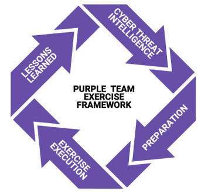

# Purple Team Exercise Framework (PTEF)

Created and Provided to the Community by

Jorge Orchilles - Chief Technology Officer

## Summary

This document defines a **Purple Team Exercise Framework (PTEF)** to facilitate the creation of a formal Purple Team Program by performing adversary emulations as **Purple Team Exercises** and/or **Continuous Purple Teaming Operations**. A Purple Team is a virtual team where the following teams work together:

- Cyber Threat Intelligence - team to research and provide threat TTPs
- Red Team - offensive team in charge of emulating adversaries
- Blue Team - the defenders. Security Operations Center (SOC), Hunt Team, Digital Forensics and Incident Response (DFIR), and/or Managed Security Service Provides (MSSP)

While Red Team Engagements are considered &quot;zero knowledge&quot; engagements, where Blue Teams are unaware of the adversary emulation prior to or during the engagement, a **Purple Team Exercise** is a full knowledge engagement where the attack activity is exposed and explained to the Blue Team as it occurs. Purple Team Exercises are &quot;hands-on keyboard&quot; exercises where Red and Blue teams work together with an open discussion about each attack technique and defense expectation to improve people, process, and technology in real-time. Purple Team Exercises are Cyber Threat Intelligence led, emulating Tactics, Techniques, and Procedures (TTPs) leveraged by known malicious actors actively targeting the organization to identify and remediate gaps in the organization&#39;s security posture.

At a high level, a Purple Team Exercise is executed with the following flow:

1. Cyber Threat Intelligence, Exercise Coordinator, or Red Team presents the adversary, TTPs, and technical details
2. Attendees have a table-top discussion of security controls and expectations for TTP
3. Red Team emulates the TTP
4. Blue Team (SOC and Hunt team) and DFIR analysts follow process to detect and respond to TTP
5. Share screen if TTP was identified, received alert, logs, or any forensic artifacts
6. Document results - what worked and what did not
7. Perform any adjustments or tuning to security controls to increase visibility
8. Repeat TTP
9. Document any feedback and/or additional Action Items for Lessons Learned
10. Repeat from step 1 for next TTP

## Goals

Purple Team Exercises are triggered by specific needs that arise to train Red and Blue Team members or improve process or technology with the end goal of increasing resilience to current threats. Once the trigger or need for a Purple Team Exercise is identified, specific goals should be defined and documented which then can be leveraged to drive the planning process. Purple Team Exercises may be triggered for one or more of the following reasons:

- Test attack chains against a target organization
- Train the organization&#39;s defenders (Blue Team)
- Test TTPs that have not been tested before in the organization
- Test the processes between security teams
- Preparation for a zero-knowledge Red Team Engagement
- Red Team reveal or replay after a zero-knowledge Red Team Engagement
- Foster a collaborative culture within the security organization

## Methodology

Purple Team Exercises follow similar methodologies as zero-knowledge Adversary Emulations. Purple Team Exercises are Cyber Threat Intelligence led, emulating Tactics, Techniques, and Procedures (TTPs) leveraged by known malicious actors actively targeting the organization to identify and remediate gaps in the organization&#39;s security posture. The following methodology is a good starting point for the development of a Purple Team Program and useful for **Purple Team Exercises** and **Continuous Purple Teaming Operations.**

Other Methodologies and Frameworks:

- [MITRE ATT&amp;CK](https://attack.mitre.org/)
- [Cyber Kill Chain](https://www.lockheedmartin.com/en-us/capabilities/cyber/cyber-kill-chain.html) – Lockheed Martin
- [Unified Cyber Kill Chain](https://www.csacademy.nl/images/scripties/2018/Paul-Pols---The-Unified-Kill-Chain.pdf) – Paul Pols
- [CBEST Intelligence Led Testing](https://www.bankofengland.co.uk/-/media/boe/files/financial-stability/financial-sector-continuity/cbest-implementation-guide) – Bank of England
- [Threat Intelligence-Based Ethical Red Teaming](https://www.ecb.europa.eu/pub/pdf/other/ecb.tiber_eu_framework.en.pdf) (TIBER) – European Central Bank
- [Red Team: Adversarial Attack Simulation Exercises](https://abs.org.sg/docs/library/abs-red-team---adversarial-attack-simulation-exercises-guidelines.pdf) – Association of Banks in Singapore
- [Intelligence-led Cyber Attack Simulation Testing](https://www.hkma.gov.hk/media/eng/doc/key-information/speeches/s20160518e2.pdf) – Hong Kong Monetary Authority
- [A Framework for the Regulatory Use of Penetration Testing in the Financial Services Industry](https://www.gfma.org/correspondence/gfma-framework-for-the-regulatory-use-of-penetration-testing-in-the-financial-services-industry/) – Global Financial Markets Association

## Roles and Responsibilities

Successful Purple Team Exercises require the active planning and participation of a wide range of Red and Blue Team members throughout the (1) Cyber Threat Intelligence, (2) Preparation, (3) Exercise Execution and (4) Lessons Learned phases of the exercises. It is important that participants be identified and informed of their responsibilities as soon as possible in the Preparation Phase.

| **Title** | **Role** | **Responsibility** |
| --- | --- | --- |
| Head of Security | Sponsor | Approve Purple Team Exercise and Budget |
| Cyber Threat Intelligence | Sponsor | Cyber Threat Intelligence |
| Red Team Manager | Sponsor | Preparation: Define Goals, Select Attendees |
| Blue Team Manager | Sponsor | Preparation: Define Goals, Select Attendees |
| DFIR Manager | Sponsor | Preparation: Define Goals, Select Attendees |
| Red Team | Attendee | Preparation, Exercise Execution |
| SOC (Blue Team) | Attendee | Preparation, Exercise Execution |
| Hunt Team (Blue Team) | Attendee | Preparation, Exercise Execution |
| Digital Forensics &amp; Incident Response (DFIR) | Attendee | Preparation, Exercise Execution |
| Project Manager | Exercise Coordinator | Lead point of contact throughout the entire Purple Team Exercise. Responsible to ensure Cyber Threat Intelligence is provided. Ensures all Preparation steps are taken prior to Exercise Execution. During Exercise Execution, record minutes, notes, action items, and feedback. Send daily emails with those notes as well as guidance for what&#39;s planned for the next day. Compile and deliver Lessons Learned. |

## Sponsors

Management from all participating functions must approve and support the Purple Team Exercise, including the goals, budget, and scope prior to any additional work in the Preparation or other phases of the exercise. Following management approval, operational managers must provide approval as operations will most likely be impacted during the exercise period; analysts that have daily work duties will need to be focused on the exercise. Operational managers are responsible for choosing exercise attendees from their teams and removing daily obligations from those individuals during the exercise period.

## Cyber Threat Intelligence

The Cyber Threat Intelligence Manager or a third party are required to provide actionable cyber threat intelligence early in the exercise preparation phase. This team will be responsible for identifying adversaries with the opportunity, intent, and capability to attack the organization as well as consume and extract the adversary behavior, tactics, techniques, and procedures (TTPs), and tools leveraged by the adversary. Cyber Threat Intelligence analysts may participate in other phases of the Purple Team Exercise as spectators and learn more about the organization from the Lessons Learned phase.

## Red Team

The Red Team is required to complete a number of responsibilities during the preparation phase and be active during the Exercise Execution. Preparation is similar to the amount of time dedicated to the planning phase of a zero-knowledge Red Team Engagement. Operational manager(s) should remove other tasks from Red Team members for successful preparation.

## Security Operations Center (Blue Team)

The Security Operations Center (SOC) Manager should plan to attend and have SOC analysts participate in the exercise. Very little time is expected from the SOC in the Preparation phase but the full attention of analysts in attendance is required during the Exercise Execution. SOC management should plan accordingly, removing daily duties from the exercise attendees. Other analysts should be scheduled to cover global operations in the exercise attendee&#39;s absence.

Organizations that do not have a Security Operations Center and leverage Managed Security Service Providers (MSSP) can also perform Purple Team Exercises. It will require planning and approval from the MSSP to ensure they approve participation in the exercise.

## Hunt Team (Blue Team)

If the organization has a Hunt Team, they should participate, as well. Very little time is expected from the Hunt Team in the Preparation phase but the full attention of analysts in attendance is required during the Exercise Execution. The Hunt Team Manager should share their most up-to-date Playbooks during the Preparation Phase to ensure ideal TTPs are chosen for the exercise. Examples of playbooks are available from [ThreatHunter-Playbook](https://github.com/hunters-forge/ThreatHunter-Playbook).

## Digital Forensics &amp; Incident Response (Blue Team)

Digital Forensics and Incident Response (DFIR) analysts should participate in the Purple Team Exercise, as well. Very little time is expected from (DFIR) teams in the Preparation phase but the full attention of analysts in attendance is required during the Exercise Execution. DFIR Managers should remove all incident cases from exercise attendees so daily case work can continue and attendance will not affect the DFIR analyst&#39;s performance.

## Cyber Threat Intelligence

The following methodology for leveraging Cyber Threat Intelligence for Purple Team Exercises was inspired by a Katie Nickels and Cody Thomas presentation during the SANS Threat Hunting &amp; Incident Response Summit on Sept. 6, 2018, titled: &quot;[ATT&amp;CKing the Status Quo: Threat-Based Adversary Emulation with MITRE ATT&amp;CK](https://www.sans.org/cyber-security-summit/archives/file/summit-archive-1536260992.pdf)&quot;. MITRE has free training &quot;[Using ATT&amp;CK for Cyber Threat Intelligence Training](https://attack.mitre.org/resources/training/cti/)&quot;. The graphics were created by Erik van Buggenhout of [NVISO](https://www.nviso.eu/):

## Understand the Target Organization

Whether you are a consulting company performing Cyber Threat Intelligence or an internal team, it is very important to understand the target organization. To understand the target organization, the Cyber Threat Intelligence provider should carry out a broad exercise, of the kind typically undertaken by threat actors, as they prepare for their attack from outside the network. The objective is to form a detailed preliminary picture of the entity and its weak points from the attacker&#39;s perspective. This will enable the Cyber Threat Intelligence to be put into context and will contribute to the development of the attack chains or attack scenarios in the Cyber Threat Intelligence Report. Some information should be provided by the entity based on interviews and discussions. The output of this activity is the identification of the attack surfaces of people, processes, and technologies relating to the entity and its digital footprint.

## Identify the Adversary to Emulate

Consider who&#39;s targeting the target organization. For Purple Team Exercises, one will want to consider the adversary&#39;s capability, intent, and opportunity. If the organization is new to Adversary Emulations, start with lower sophistication actors and work into more sophisticated ones as the Purple Team Program matures. The below definitions are taken from the [SANS Digital Forensics Blog](https://digital-forensics.sans.org/blog/2009/07/23/security-intelligence-introduction-pt-2/):

- **Intent:** _Intent stems in a way from impact. It is immutable and driven by the industry you are in just as Impact is. Typically, at a high level, the intent of adversaries to whom security intelligence techniques are applied is data theft. Of course, for each intrusion, each compromise, or each actor, the intent will most likely be slightly different. Is the goal of the adversary to compromise operational details of a campaign, or technical details of a widget? There is nothing that can be done to influence intent._
- **Opportunity:** _Opportunity is about timing and knowledge of the target space. In some cases, it pairs with vulnerability, but not always. It is one thing to be using a product with a 0-day vulnerability in it, but quite another when your adversary knows this. In other respects, however, opportunity is less related. For instance, wouldn&#39;t a company&#39;s benefits open enrollment period be a great time for a targeted attack on users using socially-engineered, topically-relevant email as a delivery vector?_
- **Capability:** _Put simply, capability is the ability of adversaries to successfully achieve their intended goal and leverage opportunity. It is influenced by things such as the skills of the adversaries and the resources (financial, human, and technical) available to them. To extend the 0-day example, a target may be vulnerable, the adversary may intend to steal data by exploiting this 0-day, but if he or she cannot write or obtain the exploit, then the risk is lower._

## Gather Cyber Threat Intelligence

Cyber Threat Intelligence may be obtained through open source intelligence, a vendor, or created internally (internal Cyber Threat Intelligence may already be created). It is important to use multiple sources and consider the industry sources such as Information Sharing and Analysis Centers (ISACs). There are many types of Cyber Threat Intelligence as shown in [David Bianco&#39;s Pyramid of Pain](https://detect-respond.blogspot.com/2013/03/the-pyramid-of-pain.html):

[David Bianco&#39;s Pyramid of Pain](https://detect-respond.blogspot.com/2013/03/the-pyramid-of-pain.html)

The type of Cyber Threat Intelligence needed for performing Adversary Emulation and our Purple Team Exercises are at the top of the Pyramid of Pain:

- Tactics, Techniques and Procedures (TTPs): How the adversary goes about accomplishing their goals, from initial access all the way through exfiltration and impact. Here is where we can map to [MITRE ATT&amp;CK](https://attack.mitre.org/).
- Tools: Software used by the adversary to accomplish their goals. These may be custom malware, open source tools, or tools that come with the systems (often referred to as [Living of the Land](https://lolbas-project.github.io/)). A great list of Command and Control frameworks and tools is available at [The C2 Matrix](https://thec2matrix.com/).
- Host Artifacts: Observables caused by adversary activities on one or more hosts. Examples can be registry keys and values, files or directories, and/or services that are created or modified.

## Extract TTPs

At this step, the Cyber Threat Intelligence analysts should extract TTPs from the Threat Intelligence acquired and map it to a framework like ATT&amp;CK, the industry standard to identify and document common TTPs of adversaries. Tactics, Techniques, and Procedures are often abbreviated as TTPs and clustered together as one thing: &quot;The adversary&#39;s TTPs.&quot; However, they represent three different aspects of adversary activity at different levels of abstraction. Tactics are high-level methods to achieve a goal (e.g. Initial Access, Exfiltration). Techniques and sub-techniques (introduced in July 2020) are one step down that refer to how that goal will be achieved (e.g. Spear Phishing a link, Credential Dumping). Procedures are the granular step that describes the steps taken in achieving the goal.

## Analyze and Organize

Creating an Adversary Profile is a great way of establishing a high-level plan for how the Red Team will execute the exercise. The goal is to have a simple document to show what the Red Team will emulate. It can be a simple table like this:

| **Tactic** | **Description** |
| --- | --- |
| Description | Description of adversary |
| Objective | Adversary objectives and goals |
| Command and Control | Technique ID - Technique Name - Details |
| Initial Access | Technique ID - Technique Name - Details |
| Execution | Technique ID - Technique Name - Details |
| Defense Evasion | Technique ID - Technique Name - Details |
| Discovery | Technique ID - Technique Name - Details |
| Privilege Escalation | Technique ID - Technique Name - Details |
| Persistence | Technique ID - Technique Name - Details |
| Credential Access | Technique ID - Technique Name - Details |
| Exfiltration | Technique ID - Technique Name - Details |

MITRE has developed the [ATT&amp;CK Navigator](https://mitre-attack.github.io/attack-navigator/enterprise/), a web application that represents the ATT&amp;CK techniques in a dynamic fashion. It can be used to select specific techniques based on a threat group or software, after which modifications and annotations can be made. It may have TTPs assigned to an adversary that was not provided in the Cyber Threat Intelligence. Note that the techniques for Groups/Software in Navigator are fully referenced to open sources on MITRE ATT&amp;CK [Groups](https://attack.mitre.org/groups/)and [Software](https://attack.mitre.org/software/) pages. Navigator is open-source and can be self-hosted.

## Table Top TTPs with Managers

The Sponsors and Managers of the teams should review the TTPs provided by Cyber Threat Intelligence and perform a table-top exercise to pick the TTPs that should be emulated during the Purple Team Exercise. **The earlier the TTPs are chosen, the earlier the Preparation phase can begin**. The TTPs chosen should be actively used by malicious actors targeting the organization and built into attack chains. New TTPs may also be used and are ideal for Continuous Purple Team Operations.

A management level meeting should occur to cover what controls are expected for those TTPs and which teams should have visibility of the TTP activity. TTPs chosen for the exercise should be classified as follows:

- TTPs that are not blocked or prevented - these will provide little value in the exercise but could be emulated if the TTP needs to be highlighted as a concern
- TTPs that may be logged - these are ideal to train hunt teams and have detection engineers create better detection and alerting
- TTPs that may be alerted - these are ideal to train SOC analysts to action and test defensive processes.

A matrix should be created showing expected outcomes and team participation:

| **Test Case** | **Tactic** | **Technique** | **ATT&amp;CK Mapping** | **Expected Detection** | **Expected Visibility** |
| --- | --- | --- | --- | --- | --- |

## Create an Adversary Emulation Plan

The Red Team will be required to know the TTPs in the Preparation Phase to create the adversary emulation plan/playbook and set up the attack infrastructure. Sponsors and Managers should decide if to share the TTPs with participants before the Exercise Execution Phase. A great, free solution for tracking and reporting Purple Team Exercises is [VECTR](https://vectr.io/).

Examples of Adversary Emulation Plans are available from the following resources:

- [SCYTHE Community Threats Github](https://github.com/scythe-io/community-threats)
- [Mordor project](https://github.com/hunters-forge/mordor) has multiple plans
- [MITRE ATT&amp;CK Adversary Emulation Plan for APT3](https://attack.mitre.org/resources/adversary-emulation-plans/)
- [MITRE ATT&amp;CK Adversary Emulation Plan for APT29](https://github.com/mitre-attack/attack-arsenal/tree/master/adversary_emulation/APT29/Emulation_Plan)

## Preparation

Purple Team Exercises can run for a few hours, days, or weeks of &quot;hands on keyboard&quot; work between Red Team, SOC, Hunt Team, and DFIR teams. Preparation time is based on the trigger that initiated the exercise, defined goals to satisfy the triggers, guidance or constraints set by Sponsors, and the emulated adversary&#39;s tactics, techniques and procedures (TTPs).

| **Preparation** | **Exercise** | **Lessons Learned** |
| --- | --- | --- |
| 2-8 weeks | Days, Weeks | 2 Weeks |

## Logistics

Once attendees have been chosen, logistics planning can begin. Determining the appropriate location for Purple Team Exercises is critical to the preparation time as travel can be a deciding factor in exercises moving forward. The ideal location is generally SOC locations where SOC, Hunt Team, and/or Digital Forensics and Incident Response analysts are present. If travel is not possible, Purple Team Exercises can be performed remotely through video conferencing. Choose a video conferencing solution that fits your threat model. Note that various attack techniques that

Standard processes should be followed to obtain travel approval, which should be completed at least a month prior to the Purple Team Exercise to ensure all required attendees are approved. Exercise attendees should plan to arrive the day before the kick off to ensure timely arrival to the exercise environment.

One dedicated conference room with sufficient space for all attendees, sponsors and observers and their equipment is required for the length of the week. Moving spaces throughout the week will delay exercise activity as technology must be retested and attendees may not easily find the new location. A training room may be leveraged as the exercise location but sharing every screen with a projector or TV will not be as efficient as with the technology in conference rooms.

Every attendee should arrive with a workstation with media output to quickly show the current screen to other participants (HDMI, DVI, and VGA). If being done remotely, screen sharing should be trivial with the selected video conferencing solution.

## Target Systems

The Exercise Coordinate should work with stakeholders to identify and provision target systems in production based on the approved Purple Team Exercise goals and adversary emulation plan. Production systems are the most accurate representation of systems in the environment as they should have security tools reporting to production dashboards and allow processes to be accurately tested.

Based on the approved goals and TTPs, the target systems may be requested following normal process to ensure consistency with production systems:

- **Endpoint Operation Systems**
  - Standard endpoints - 2 of each (Windows 10, Linux, macOS)
  - Physical systems
  - Virtual Desktop Infrastructure
  - Terminal Services/Citrix
- **Server Operating Systems in Environment**
  - Windows Servers
  - \*nix Servers
  - Include Virtual and Cloud Servers

## Security Tools

Request the target systems have standard, production security tools deployed in the organization:

- Anti-Virus/Anti-Malware/Anti-Exploit
- Endpoint Detection &amp; Response (EDR)
- Forensic Tools
  - Image acquisition
  - Live forensics
- Ensure flow of traffic goes through standard, production network-based devices such as firewalls and proxy logs

## Target Accounts

Target accounts (a.k.a service accounts, functional IDs) should be created for logging into systems, accessing proxies/internet, email, etc. and to ensure real production credentials are not compromised during the Purple Team Exercise.

- Request new account of a standard user
- Request Standard Email and Proxy/internet access
- Add new account as local administrator of the target systems

## Attack Infrastructure

Red Team is responsible for establishing the Purple Team Exercise attack infrastructure (internal or external dependent upon TTPs). This involves acquiring the tools that will emulate the adversary behaviors and TTPs. [SCYTHE](https://scythe.io/) is the industry leading Purple Team platform.

### External Infrastructure

- Choose and procure external hosting provider
- Create external virtual machines
  - Only allow connection from target organization outbound IP Addresses and Red Teamer IP Addresses
  - Setup credential theft site and/or payload delivery sites
  - Setup C2 Infrastructure – based on payloads and TTP
  - Setup redirectors/relays
- Ensure SMTP servers allow sending emails into organization
  - Shared Email Service should be allowed in
  - If using new SMTP servers, this may require more time for gaining reputation
- Purchase Domains
- Generate or purchase TLS Certificates
- Setup Domain Fronting (if required)
- Categorize domains or ensure proxies/outbound controls allow access
- Provide IPs and Domains to Blue Team if testing will be performed before the exercise
- Test payloads and domains with Blue Team Manager to ensure allowlists are complete and payloads/C2 is working. This should be done against test systems; not the same one for the exercise.

### Internal Infrastructure

- Create internal virtual machines for attack
- Ensure white listed on Network Access Control solutions
- Setup C2 Infrastructure – based on payloads and TTP
- Test payloads as Purple Team with Blue Team manager to ensure payloads/C2 is working. This should be done against test systems; not the same one for the exercise.

## Red Team Preparation

- Setup at least 2 systems to show attack activity
- Ensure Attack Infrastructure is fully functional
- Ensure Target Systems are accessible functional
- Document all commands required to emulate TTPs in playbook
- Setup resource scripts/framework equivalent to generate payloads and setup handlers
- Test TTPs before exercise on different hosts than the exercise hosts but that are configured exactly alike

## Blue Team Preparation

- Validate security tools are reporting to production security tools from the target systems
- Ensure attack infrastructure is accessible through proxy/outbound controls
- Ensure attack infrastructure is being decrypted (TLS decryption/interception)
- Verify allowlists and notify Red Team
- Work with Red Team as payloads and C2 are tested prior to exercise on non-exercise systems

- Create an exercise case as per the DFIR process
  - This will allow tagging artifacts and following normal processes without flagging any suspicious activity (e.g. pulling memory from a system that does not have a formal case)
  - Ensure the target systems are not segmented or wiped as they will be used throughout the exercise. It is worth noting that DFIR results serve as a great resource for Cyber Threat Intelligence.
- Ensure the correct forensic tools are deployed on the target systems
- Install Live Forensic Tools for efficiency during Purple Team Exercise. For example:
  - Sysmon
  - Processmon

## Exercise Execution

Red Team &amp; Blue Team Managers should arrive early to ensure all systems are working:

- Video conference
- Presentation mode
- Attack Infrastructure accessible
- Target systems accessible

## Kick Off

A Manager of one of the teams, or the CISO, should kick the Purple Team Exercise off by stating the value Purple Team Exercises bring to resiliency while highlighting the progress made due to previous Purple Team Exercises. The kick off should consist of a 10-15 minute motivation speech that gains interest from attendees about the value of the work to be done in the week ahead. The flow of the Purple Team Exercise should be presented.

## Exercise Flow

1. Cyber Threat Intelligence, Exercise Coordinator, and/or Red Team presents the adversary, TTPs, and technical details:
    - Adversary behavior
    - Procedure
    - Tool used
    - Attack Vector
    - Delivery Method
    - Privilege gained
2. Purple Team discussion of expected controls based on TTP
  - SOC: Any logs or alerts for this TTP
  - Hunt Team: Any Hunt Cases for this TTP
  - DFIR: Documented methods to identify if TTP was leveraged
3. Red Team executes the TTP
  - Provides attacker IP
  - Provides target
  - Provides exact time
  - Shows the attack on projector
4. SOC, Hunt, and DFIR follow process to identify evidence of TTP
  - Time should be monitored to meet expectation and move exercise along
5. Share screen if TTP was identified, received alert, logs, or forensics
  - Time to detect
  - Time to receive alert
  - Red Team stops TTP
  - Show on screen TTP evidence stopped
  - Red Team runs TTP again
6. Document results - what worked and what did not
7. Are there any short term adjustments that can increase visibility?
  - Implement adjustment
  - Red Team repeats TTP
8. Document any feedback and/or Action Items for TTP
9. Repeat for next TTP

## Tracking Exercise

At least one dedicated Exercise Coordinator should be on site to take minutes, notes, action items, and attendee or sponsor feedback. Daily emails should be sent to all attendees and sponsors with minutes, action items, as well as what is planned for the next day. Tracking of the TTPs can be done through a variety of ways:

- [VECTR](https://vectr.io/) is a great, free solution for tracking and reporting Purple Team Exercises
- Detect Tactics, Techniques &amp; Combat Threats ([DeTT&amp;CT](https://github.com/rabobank-cdc/DeTTECT))

## Lessons Learned

Exercise Coordinators are responsible for taking minutes, notes, action items, and attendee/sponsor feedback. The Exercise Coordinators are also responsible for the creation of a Lessons Learned document (Report) following each exercise. A feedback request should be sent to all attendees on the last day of the Purple Team Exercise to obtain immediate feedback while it is fresh on attendee&#39;s minds. Lessons Learned documents should be completed and sent to Sponsors and Attendees less than 2 weeks after the exercise has concluded.

An example of a Purple Team Exercise report is available at [Defensive Origins Github](https://github.com/DefensiveOrigins/AtomicPurpleTeam/tree/master/Playbook). Other resources include CyberWarDogs post &quot;[How Hot is Your Hunt Team](https://cyberwardog.blogspot.com/2017/07/how-hot-is-your-hunt-team.html)&quot;.

## Tracking Action items

Exercise Coordinator will transfer the report to the customer stakeholder(s) that will be responsible for relaying action items to the team(s) that will track and be responsible for remediation.

## Retesting

The emulation may need to be performed a number of times, over and over, while the detection engineers work to tune the defensive controls. SCYTHE is a platform that allows the consistent, repetitive emulation of adversary behavior.

## About SCYTHE

[SCYTHE](https://www.scythe.io/) provides an advanced attack emulation platform for the enterprise and cybersecurity consulting market. The SCYTHE platform enables Red, Blue, and Purple teams to build and emulate real-world adversarial campaigns in a matter of minutes. Customers are in turn enabled to validate the risk posture and exposure of their business and employees and the performance of enterprise security teams and existing security solutions. Based in Arlington, VA, the company is privately held and is funded by Gula Tech Adventures, Paladin Capital, Evolution Equity, and private industry investors. For more information email info@scythe.io, visit [https://scythe.io](https://www.scythe.io/), or follow on Twitter [@scythe\_io](https://twitter.com/scythe_io).

Thank you to the reviewers and contributors of this document: Ben Goerz, Bryson Bort (SCYTHE), Dave Mayer (GRIMM), Erik van Buggenhout (NVISO), Jorge Orchilles (SCYTHE), Katie Nickels, Mauricio Velazco, and Xena Olsen.